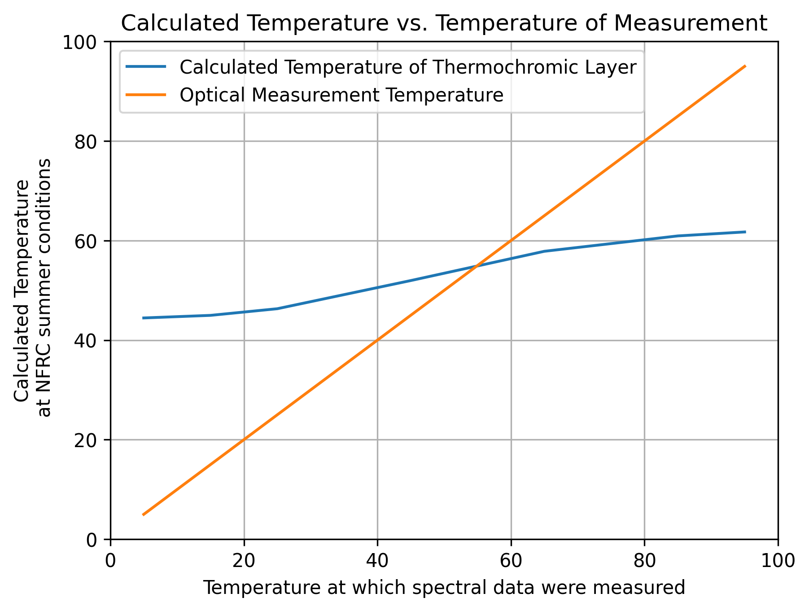
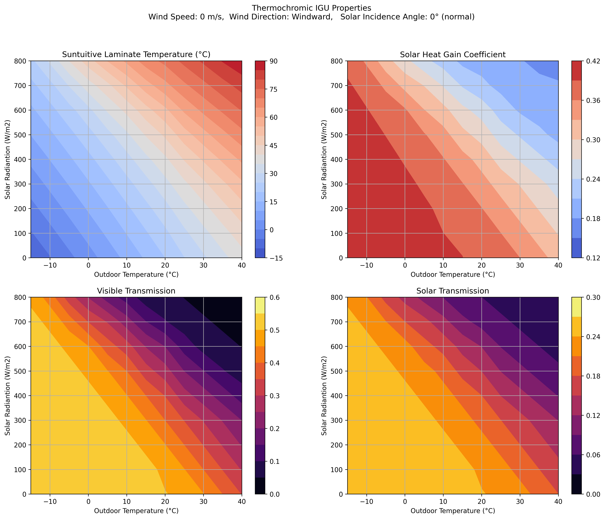
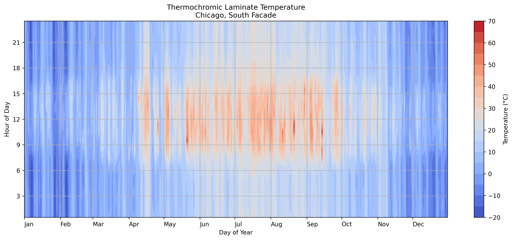
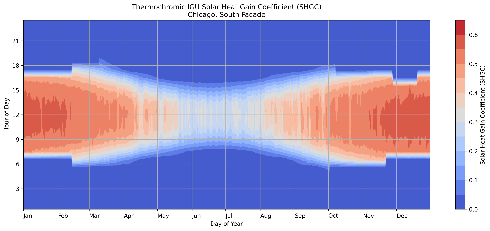
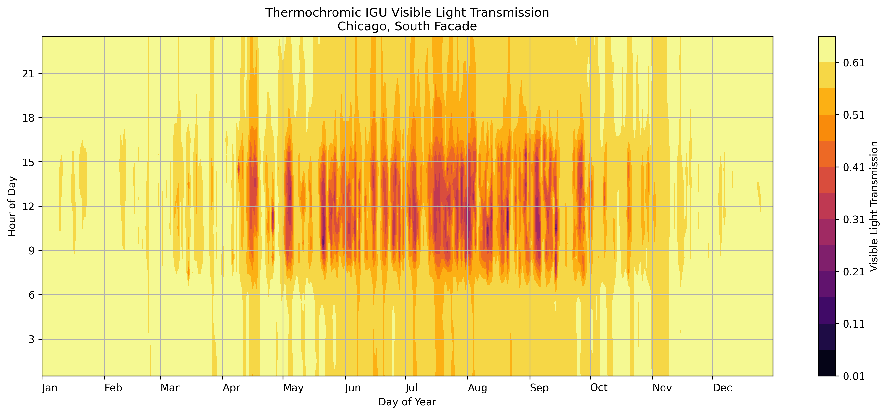

# Thermochromic IGU simulations with pyWinCalc
This repo contains an example of using pywing calc to generate performance charts for a thermochromic IGU.

I've found LBNL's python wrapper for their C++ window calculation engine (https://github.com/LBNL-ETA/pyWinCalc) to be extremely powerful for running Window simulations. Being freed from the confines of the Window user interface allows users to do so much more!

I decided to upload this example of simulations for a thermochromic window to show how it is possible to leverage the Window calculation engine to generate data and plots that were not previously possible with window.

### Determining the Temperature State of a Thermochromic IGU
Thermochromic laminates are measured at different temperatures to understand the range of spectral properties of the thermochromic layer. The challenge of conveying performance of the thermochromic IGU is that performance characteristics like visible light transmission and solar heat gain coefficient depend on the environmental charateristics, including outside air temperature, wind speed, wind dirrection, solar radiation, and solar incident angle. In order to determine the temperature state (and VLT and SHGC) of a thermochromic IGU, we need to simulate the temperature under environmental conditions for the measured optical states. Then we can find the equilibrium state for those environmental conditions by looking to see where the simulated temperature matches the temperature at which the optical properties were measured. In the plot below the blue line shows the simulated temperature (y-axis) for the measurement state temperatures (x-axis). The equillibrium temperature is where the blue line crosses the orange line (and the simulated and measured temperatures match). 

<p align='center'>

</p>

### Chart of Thermochromic IGU Properties
The charts below show for a give wind speed (0 m/s) and solar incidence angle (0°) what the thermochromic layer temperature would be for different exterior air temperatures (x-axis) and solar insolation (y-axis). These calculations were performed with pywincalc by creating 108 custom environments (12 exterior temperature x 9 solar radiation) and layer performance for 19 laminate temperatures (5°C - 95°C, in 2.5°C increments). For each environmental condition the temperature of the laminate was calculated using the absorption properities of the 18 thermochromic layer temperatures. The correct result for the environmental condition is where the simulated laminate temperature matches the themperature of the optical properties.




### Chart of Annual Thermochromi IGU properties for a south facing facade in Chicago
Taking this a step further, we can read environmental conditions from a weather file, including wind speed, wind direction, exterior temperature, solar radiation and solar incident angle and calculate the equilibrium temperature of the thermochromic laminate for every hour of the year. The charts below are an annual plot of temperature, solar heat gain coefficent, and visible light transmission of the thermochromic IGU.






## Setup on Mac OSX
This requires a working installation of python 3 and git.
```
# Download the contents of this repo:
git clone https://github.com/andyrew/Thermochromic-pywincalc.git

# Create a python virtual environment
python3 -m venv pyenv_thermochromic

# Activate the python virtual environment
source pyenv_thermochromic/bin/activate

# Install the interactive python notebook jupyter
pip install notebook ipykernel

# Tell the interactive python environment to use the virtual environment
python -m ipykernel install --user --name=pyenv_thermochromic

# Install the python libraries used in the example
pip install pywincalc numpy matplotlib pysolar epw pandas scipy

#Launch the interactive notebook
jupyter notebook
```
